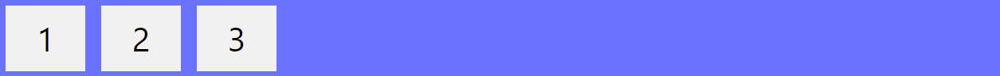
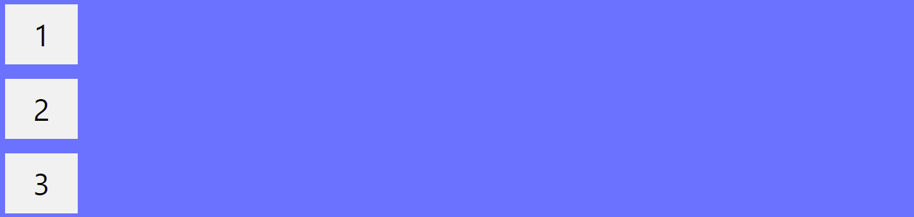
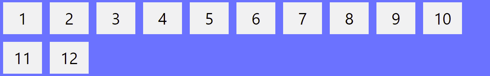

## LAB 7 - CSS Layout

Before the Flexbox Layout module, there were four layout modes:

Block, for sections in a webpage
Inline, for text
Table, for two-dimensional table data
Positioned, for explicit position of an element
The Flexible Box Layout Module, makes it easier to design flexible responsive layout structure without using float or positioning.

### Flexbox Elements

To start using the Flexbox model, you need to first define a flex container.



The element above represents a flex container (the blue area) with three flex items.

The HTML File:
```html
<div class="flex-container">
  <div>1</div>
  <div>2</div>
  <div>3</div>
</div>
```

The CSS file:
```css
.flex-container {
  display: flex;
  background-color: DodgerBlue;
}

.flex-container > div {
  background-color: #f1f1f1;
  margin: 10px;
  padding: 20px;
  font-size: 30px;
}
```

### Parent Element (Container)
Like we specified in the previously , this is a flex container (the blue area) with three flex items:


The flex container becomes flexible by setting the display property to flex:

```css
.flex-container {
  display: flex;
}
```

The flex container properties are:

- flex-direction
- flex-wrap
- flex-flow
- justify-content
- align-items
- align-content

### The flex-direction Property

The flex-direction property defines in which direction the container wants to stack the flex items.



The column value stacks the flex items vertically (from top to bottom):

```css
.flex-container {
  display: flex;
  flex-direction: column;
}
```

The column-reverse value stacks the flex items vertically (but from bottom to top):

```css
.flex-container {
  display: flex;
  flex-direction: column-reverse;
}
```

The row value stacks the flex items horizontally (from left to right):

```css
.flex-container {
  display: flex;
  flex-direction: row;
}
```

The row-reverse value stacks the flex items horizontally (but from right to left):

```css
.flex-container {
  display: flex;
  flex-direction: row-reverse;
}
```

### The flex-wrap Property

The flex-wrap property specifies whether the flex items should wrap or not.

The examples below have 12 flex items, to better demonstrate the flex-wrap property.



The wrap value specifies that the flex items will wrap if necessary:

```css
.flex-container {
  display: flex;
  flex-wrap: wrap;
}
```

The nowrap value specifies that the flex items will not wrap (this is default):

```css
.flex-container {
  display: flex;
  flex-wrap: nowrap;
}
```

The wrap-reverse value specifies that the flexible items will wrap if necessary, in reverse order:

```css
.flex-container {
  display: flex;
  flex-wrap: wrap-reverse;
}
```

### The flex-flow Property

The flex-flow property is a shorthand property for setting both the flex-direction and flex-wrap properties.

```css
.flex-container {
  display: flex;
  flex-flow: row wrap;
}
```

### The justify-content Property

The justify-content property is used to align the flex items:


The center value aligns the flex items at the center of the container:

```css
.flex-container {
  display: flex;
  justify-content: center;
}
```

